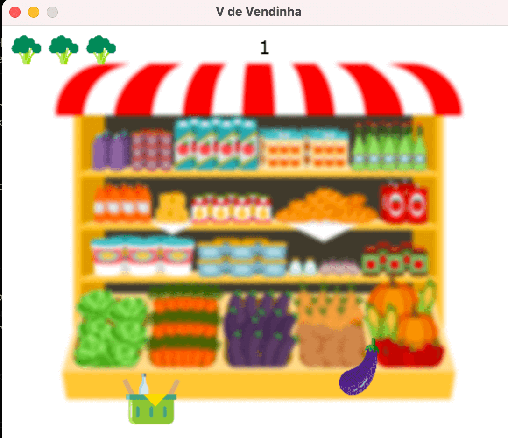
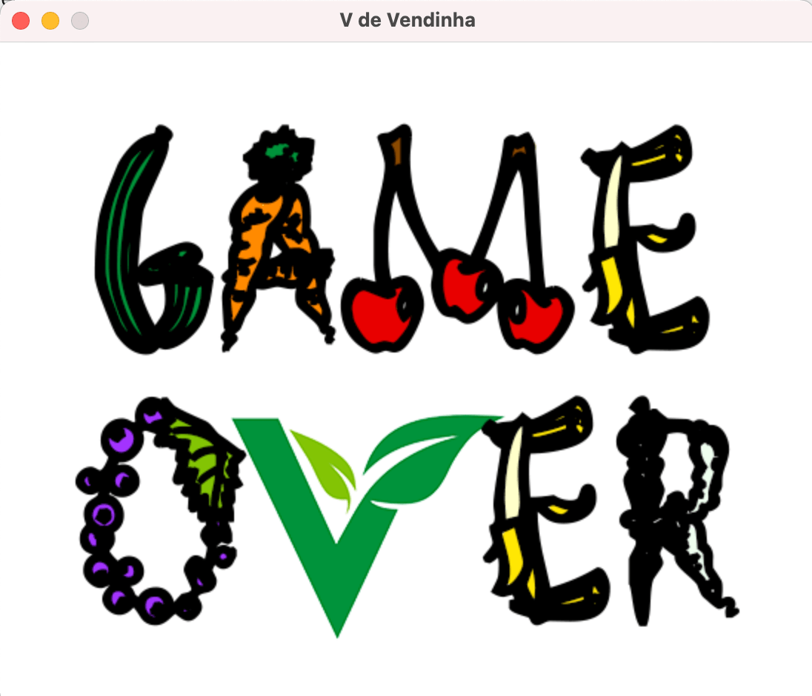

# V de Vendinha

O jogo oficial do V de Vegança. Capture o máximo de produtos e ingredientes veganos, e não deixe nada com ingredientes de origem animal cair na sua cesta.





# Pré-requisitos

Para rodar o jogo, você precisa ter Python instalado na sua máquina. Além disso, é necessário instalar o [pygame](https://www.pygame.org/news):

```
python3 -m pip install -U pygame --user
```

# Como jogar

Para iniciar o jogo, execute o seguinte comando na pasta inicial do projeto:

```
python3 app.py
```
